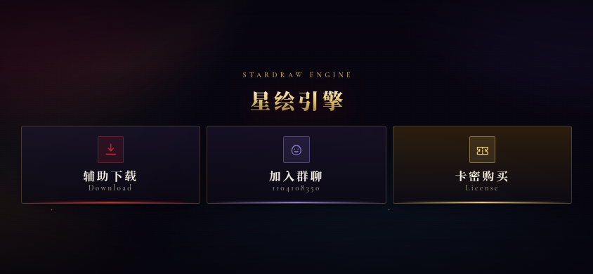

# 星绘引擎 · 单屏导航页

「星绘引擎」是**面向手机端的单屏导航页**：一块屏看完三个入口 —— **辅助下载 / 加入群聊 / 卡密购买**，不需要滑动、没有多余内容。纯 HTML + CSS + 原生 JS，零依赖、零构建。



## 部署地址

**https://xinghuiyinqing.github.io/links/**

- 仓库：`https://github.com/xinghuiyinqing/links`
- 发布方式：main 分支根目录，`.nojekyll` 已放好
- 注：Pages 域名由 GitHub 用户名决定（`<用户名>.github.io/<仓库名>`），改名后自动生效，仓库内不需要、也不能用 CNAME 去指定它
- 更新站点：改完文件 `git add -A && git commit -m "..." && git push`，Pages 约 30 秒后自动重建


## 版式与交互（单屏精简版）

| 部分 | 说明 |
| --- | --- |
| 开场动画 | 载入进度条 → 书法金字揭示 → 「点击进入」→ 幕布缩放虚化退出（约 2.5s，可跳过） |
| 主屏 | 站名 + 三个入口按钮，整屏居中，**无滚动、无页脚、无多余文案** |
| 布局 | 横屏 / 宽屏：三按钮**并排一行**；竖屏窄机：三按钮竖排（都保证一屏看完） |
| 按钮 | 绯红 / 紫 / 金三色描边发光块，带光扫与按压反馈，点击区 ≥ 44px |
| 复制 | 点「加入群聊」即复制群号 1104108350，底部 toast 提示 |
| 背景 | 极光漂移 + 光柱 + 上升光尘 + 暗角噪点，纯 CSS，手机端不卡 |

### 开场动画的控制参数

- `?intro=0` —— 关闭开场，直接进站
- `?intro=1` —— 强制播放（默认首次访问播放）
- 同一次会话内再次进入不再播放；点「跳过」或按 `Esc` / `Enter` / 空格可立即进入
- 系统开启「减少动态效果」时自动跳过动画

## 设计参考

视觉语言参考游戏官网类「暗色 + 鎏金 / 绯红」的官网风格（绯红渐变按钮、鎏金描边、书法衬线大字、光尘与极光），全部为原创实现，未使用任何第三方素材。

## 目录结构

```
.
├── index.html              # 单页，三个卡片的入口
├── assets/
│   ├── style.css           # 全部样式（深色玻璃拟态 + 浅色主题 token 切换）
│   ├── app.js              # 主题切换、一键复制、滚动入场
│   ├── preview.png         # 预览图（横屏主屏）
│   └── preview-intro.png   # 预览图（开场动画）
├── .nojekyll               # 关掉 Jekyll，保证下划线开头的文件也能发布
└── .github/workflows/pages.yml   # Pages 自动发布工作流
```

## 本地预览

```bash
# 任意静态服务器都行
python3 -m http.server 8080
# 浏览器打开 http://127.0.0.1:8080
```

## 修改入口链接

所有链接都写在 `index.html` 里，搜关键词就能改：

| 入口 | 位置 |
| --- | --- |
| 辅助下载 | `pan.quark.cn/s/dd3c3e5637be` |
| 加入群聊 | `1104108350`（群号展示 + 复制按钮 + 一键加群） |
| 卡密购买 | `ds.xiaoman.top/links/9261E5EF` |

## 特性

- 移动端优先，`clamp()` 流式排版，窄屏不溢出
- 深色 / 浅色双主题，跟随系统并可手动切换（记忆在 localStorage）
- 一键复制下载链接、购买链接、QQ 群号，带 toast 反馈
- 尊重 `prefers-reduced-motion`，键盘 focus 可见，语义化标签 + aria
- 无外部 JS 依赖，字体走 Google Fonts 且有系统字体兜底
